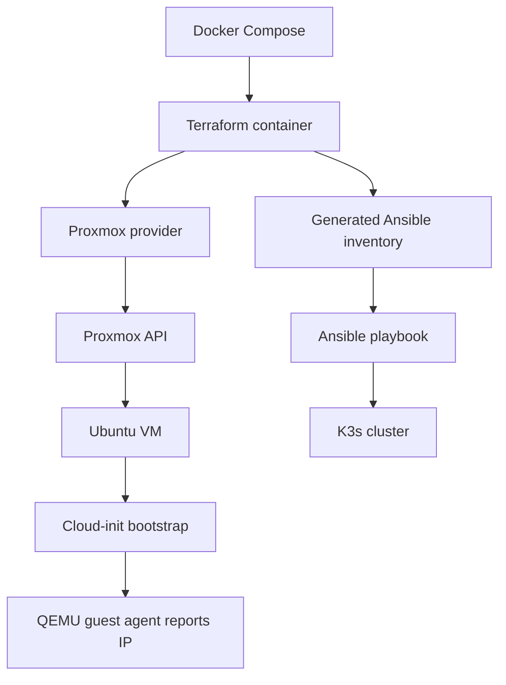

# Terraform Proxmox K3s

## Обзор проекта

Проект создаёт Ubuntu VM в Proxmox VE и разворачивает на них небольшой K3s-кластер. Terraform отвечает за инфраструктуру: Proxmox resources, cloud-init bootstrap, получение IP-адресов и генерацию Ansible inventory. Ansible отвечает за настройку ОС и установку K3s. Docker Compose используется для запуска зафиксированной версии Terraform без установки Terraform на рабочую станцию. Топология по умолчанию: один K3s server node и два K3s agent nodes.

## Архитектура



Terraform создаёт VM из Ubuntu cloud image, ждёт IP-адреса через QEMU guest agent и записывает `ansible/inventories/generated/hosts.yml`. Ansible использует этот inventory для запуска ролей `common`, `k3s_server` и `k3s_agent`.

## Структура репозитория

```text
.
├── ansible/
├── docs/
│   ├── README.md
│   ├── terraform/
│   └── k3s/
├── terraform/
│   ├── modules/
│   │   └── proxmox-cloud-vm/
│   ├── templates/
│   ├── main.tf
│   ├── outputs.tf
│   ├── providers.tf
│   ├── variables.tf
│   └── terraform.tfvars.example
├── docker-compose.yml
└── Makefile
```

| Путь | Назначение |
|---|---|
| `terraform/` | root module Terraform и локальный state |
| `terraform/modules/proxmox-cloud-vm/` | reusable модуль Ubuntu VM для k3s и standalone VM |
| `terraform/templates/` | шаблоны Terraform, включая inventory |
| `ansible/` | playbook, roles, group_vars и generated inventory |
| `docs/` | база знаний по Terraform и K3s |
| `Makefile` | основные команды проекта |

## Требования

| Зависимость | Назначение |
|---|---|
| Proxmox VE | целевая платформа виртуализации |
| Docker Compose | запуск `hashicorp/terraform:1.12` |
| Ansible | настройка ОС и установка K3s |
| SSH key pair | доступ Ansible к VM |
| Make | единый workflow команд |
| kubectl | опционально локально; K3s устанавливает kubectl на server node |

## Быстрый старт

```bash
cp .env.example .env
cp terraform/terraform.tfvars.example terraform/terraform.tfvars
```

Заполните `.env` доступами к Proxmox и проверьте в `terraform/terraform.tfvars`:

```hcl
vm_username                  = "victor"
ssh_public_key_path          = "~/.ssh/id_rsa.pub"
ansible_ssh_private_key_file = "~/.ssh/id_rsa"
ansible_inventory_path       = "../ansible/inventories/generated/hosts.yml"
```

Развернуть инфраструктуру и K3s:

```bash
make deploy
```

Проверить результат:

```bash
make output
ssh victor@<master-ip>
sudo k3s kubectl get nodes -o wide
```

## Рабочий процесс

```bash
make init
make plan
make apply
make ansible
```

Короткий полный запуск:

```bash
make deploy
```

`make deploy` выполняет `terraform init`, `terraform apply -parallelism=1` и затем `ansible-playbook`.

## Конфигурация

Основные файлы:

| Файл | Назначение |
|---|---|
| `.env` | Proxmox API/SSH параметры для Docker Compose |
| `terraform/terraform.tfvars` | значения Terraform variables |
| `ansible/inventories/group_vars/all.yml` | общие Ansible-переменные |
| `ansible/inventories/group_vars/k3s_master.yml` | переменные master-группы |
| `ansible/inventories/group_vars/k3s_workers.yml` | переменные worker-группы |

Terraform генерирует inventory:

```text
ansible/inventories/generated/hosts.yml
```

Этот файл не редактируется вручную и не хранится в Git.

## Standalone VM для Vault и другого софта

Создание VM вынесено в reusable модуль `terraform/modules/proxmox-cloud-vm/`. Root module использует его дважды:

- `module.k3s_vms` создаёт master/worker VM для K3s;
- `module.standalone_vms` создаёт VM вне K3s-кластера.

Такой подход удобен, если Vault, CI/CD runner, monitoring или другой системный сервис нужно держать отдельно от Kubernetes. Standalone VM не попадает в `ansible/inventories/generated/hosts.yml`, потому что этот inventory предназначен только для playbook установки K3s.

Пример VM для Vault уже есть в `terraform/terraform.tfvars.example`. Чтобы создать её, перенесите блок `standalone_vms` в `terraform/terraform.tfvars` и задайте уникальный `vm_id`.

## Выходные значения Terraform

| Output | Описание |
|---|---|
| `created_vms` | VM name, VMID, role и IPv4 data |
| `master_ip` | IPv4 адрес K3s server node |
| `worker_ips` | IPv4 адреса K3s agent nodes |
| `inventory_path` | путь к generated Ansible inventory |
| `standalone_vms` | standalone VM вне K3s, например будущая VM для Vault |

Показать outputs:

```bash
make output
```

## Документация

- [Индекс документации](docs/README.md)
- [Terraform](docs/terraform/README.md)
- [K3s](docs/k3s/README.md)

## Лицензия

Файл лицензии в репозитории отсутствует.
