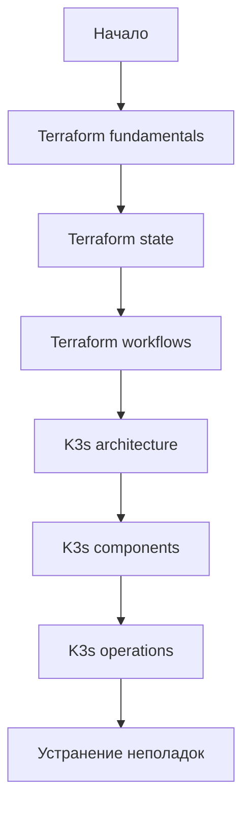

# База знаний проекта

Эта директория содержит внутреннюю техническую документацию по Terraform и K3s. Документы предназначены для обучения инженеров уровня Junior -> Middle и для сопровождения текущего проекта Proxmox + Terraform + Ansible + K3s.

## Как читать документацию

## Terraform

| Документ | Назначение |
|---|---|
| [Обзор Terraform](terraform/README.md) | Карта раздела и роль Terraform в проекте |
| [Фундаментальные концепции](terraform/fundamentals.md) | IaC, Core, resources, variables, graph |
| [State](terraform/state.md) | State, drift, import, refresh, locking, backend |
| [Modules](terraform/modules.md) | Root module, child modules, registry, структура |
| [Providers](terraform/providers.md) | Provider registry, lock file, API, версии |
| [Workflows](terraform/workflows.md) | init, fmt, validate, plan, apply, destroy |
| [Лучшие практики и антипаттерны](terraform/best-practices.md) | Практические рекомендации и плохие решения |
| [Устранение неполадок](terraform/troubleshooting.md) | Диагностика частых ошибок |

## K3s

| Документ | Назначение |
|---|---|
| [Обзор K3s](k3s/README.md) | Карта раздела и роль K3s в проекте |
| [Архитектура](k3s/architecture.md) | Kubernetes, K3s, bootstrap, HA |
| [Компоненты кластера](k3s/cluster-components.md) | kubelet, containerd, CoreDNS, Traefik, ServiceLB |
| [Сеть](k3s/networking.md) | Pod network, Service network, DNS, Ingress, CNI |
| [Хранилище](k3s/storage.md) | PV, PVC, StorageClass, local-path-provisioner |
| [Безопасность](k3s/security.md) | TLS, сертификаты, RBAC, Secrets, kubeconfig |
| [Эксплуатация](k3s/operations.md) | Обновление, backup, restore, scaling, обслуживание |
| [Лучшие практики и антипаттерны](k3s/best-practices.md) | Рекомендации и плохие решения |
| [Устранение неполадок](k3s/troubleshooting.md) | Node not ready, сеть, storage, bootstrap |

## Границы документации

Документация объясняет технологии шире, чем они используются в проекте, но практические примеры ориентированы на текущую архитектуру:

- Terraform создаёт Proxmox VM и генерирует Ansible inventory.
- Cloud-init выполняет минимальный bootstrap.
- Ansible настраивает ОС и устанавливает K3s.
- K3s разворачивается как один server node и несколько agent nodes.
