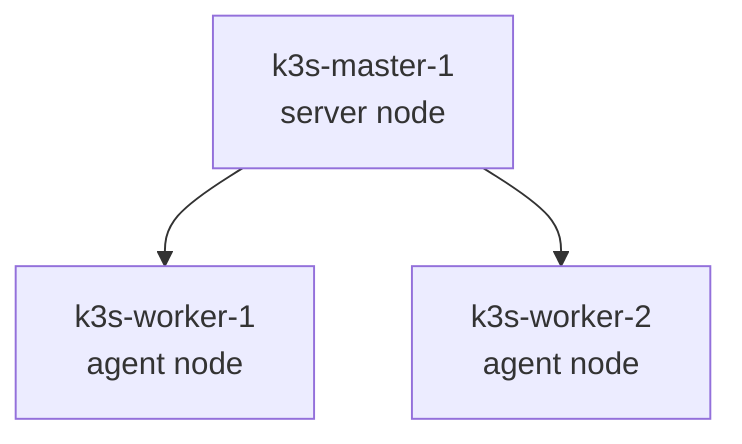

# K3s: обзор раздела

K3s — Kubernetes-дистрибутив, который в этом проекте разворачивается Ansible на VM, созданных Terraform в Proxmox.

## Что изучить

1. [Архитектура](architecture.md)
2. [Компоненты кластера](cluster-components.md)
3. [Networking](networking.md)
4. [Storage](storage.md)
5. [Security](security.md)
6. [Operations](operations.md)
7. [Лучшие практики и антипаттерны](best-practices.md)
8. [Устранение неполадок](troubleshooting.md)

## Роль K3s в проекте

Terraform создаёт VM и inventory. Ansible устанавливает:

- K3s server на master;
- K3s agent на worker nodes;
- базовые системные настройки, необходимые Kubernetes.

## Границы текущей реализации

| Возможность | Статус |
|---|---|
| Single server cluster | реализовано |
| Worker nodes | реализовано |
| Автоматическое получение token | реализовано Ansible |
| HA control plane | не реализовано |
| External datastore | не реализовано |
| Upgrade orchestration | не реализовано |
