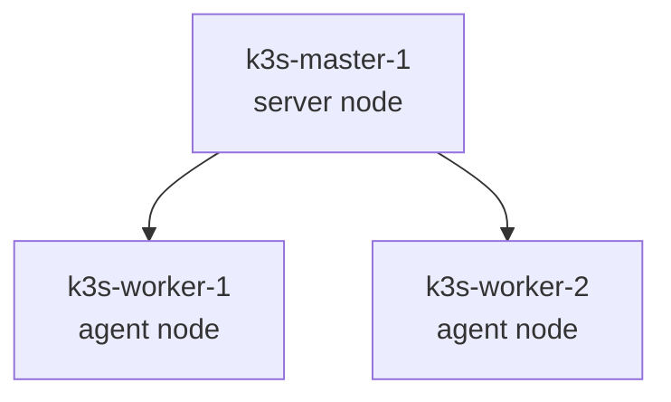

# K3s: обзор раздела

K3s — Kubernetes-дистрибутив, который в этом проекте разворачивается Ansible на VM, созданных Terraform в Proxmox.

## Что изучить

1. [Архитектура](architecture.md)
2. [Компоненты кластера](cluster-components.md)
3. [Networking](networking.md)
4. [Storage](storage.md)
5. [Security](security.md)
6. [Operations](operations.md)
7. [Лучшие практики и антипаттерны](best-practices.md)
8. [Устранение неполадок](troubleshooting.md)

## Роль K3s в проекте

```mermaid
graph TD
    M[k3s-master-1<br/>server node] --> W1[k3s-worker-1<br/>agent node]
    M --> W2[k3s-worker-2<br/>agent node]
```

Terraform создаёт VM и inventory. Ansible устанавливает:

- K3s server на master;
- K3s agent на worker nodes;
- базовые системные настройки, необходимые Kubernetes.

Важно: K3s server node по умолчанию также является worker node. На `k3s-master-1` есть `kubelet`, `containerd`, CNI и возможность запускать Pods, если node не закрыта taint-ом.

## Границы текущей реализации

| Возможность | Статус |
|---|---|
| Single server cluster | реализовано |
| Worker nodes | реализовано |
| Server node как schedulable worker | реализовано по умолчанию K3s |
| Автоматическое получение token | реализовано Ansible |
| Kubeconfig с IP master вместо 127.0.0.1 | реализовано Ansible |
| HA control plane | не реализовано |
| External datastore | не реализовано |
| Upgrade orchestration | не реализовано |
| Управление addons через Helm/GitOps | не реализовано |

## Как читать раздел

Рекомендуемый порядок:

1. `architecture.md` — общая модель Kubernetes/K3s, API objects, server/agent, datastore.
2. `cluster-components.md` — что именно работает внутри nodes и какие packaged components ставит K3s.
3. `networking.md` — Pod network, Service network, DNS, Ingress, LoadBalancer.
4. `storage.md` — PV/PVC/StorageClass и ограничения local-path.
5. `security.md` — TLS, RBAC, Secrets, kubeconfig, hardening.
6. `operations.md` — запуск, диагностика, backup, restore, upgrades.
