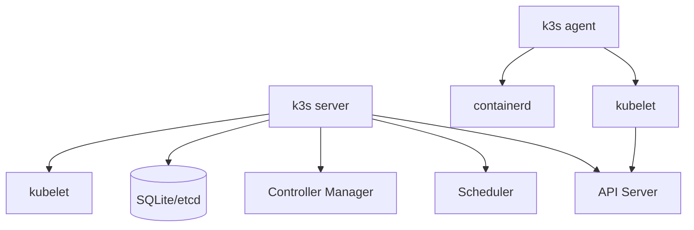
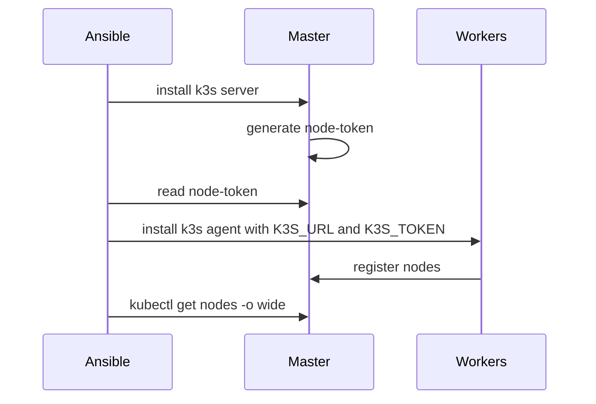
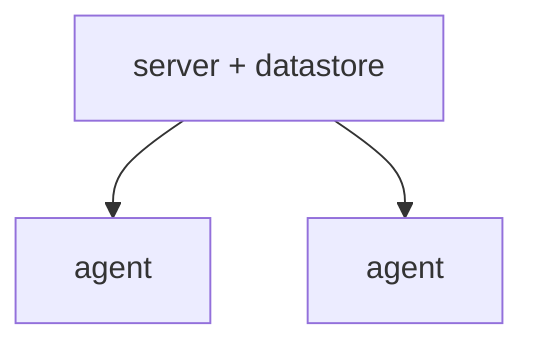
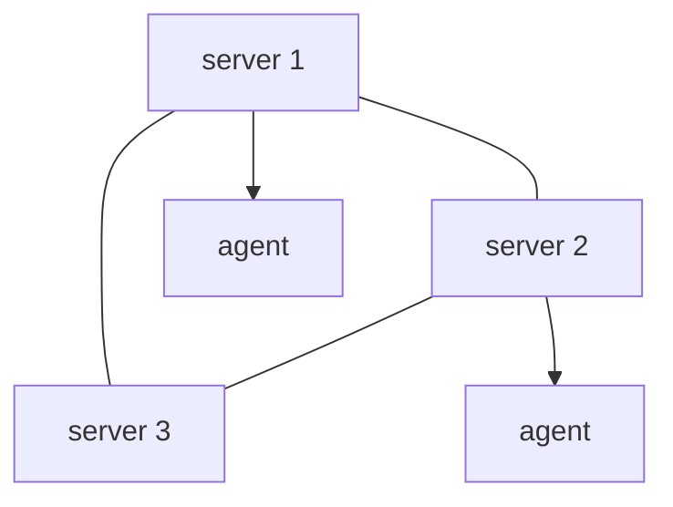

# Архитектура K3s

## Оглавление

- [Кратко о Kubernetes](#кратко-о-kubernetes)
- [Что такое K3s](#что-такое-k3s)
- [Server и agent nodes](#server-и-agent-nodes)
- [Control plane](#control-plane)
- [Bootstrap](#bootstrap)
- [High Availability](#high-availability)

## Кратко о Kubernetes

Kubernetes управляет контейнеризированными приложениями. Он решает задачи:

- запуск workload;
- self-healing;
- service discovery;
- rollout и rollback;
- управление конфигурацией и секретами;
- scheduling по узлам;
- абстракция сети и storage.

Базовые сущности:

| Сущность | Назначение |
|---|---|
| Pod | минимальная единица запуска |
| Deployment | управление репликами Pod |
| Service | стабильный сетевой доступ к Pod |
| ConfigMap | несекретная конфигурация |
| Secret | секретные данные |
| PersistentVolumeClaim | запрос постоянного хранилища |
| Ingress | HTTP/HTTPS вход в кластер |

## Что такое K3s

K3s — облегчённый Kubernetes-дистрибутив. Он упрощает установку и уменьшает количество внешних зависимостей.

Отличия от «полного» Kubernetes-дистрибутива:

- один install script;
- bundled containerd;
- встроенные компоненты: CoreDNS, metrics-server, local-path-provisioner, Traefik, ServiceLB;
- SQLite по умолчанию для single server;
- возможность embedded etcd для HA;
- меньше операционного overhead.

## Server и agent nodes

Server node содержит control plane и также может запускать workloads. Agent node подключается к server и предоставляет compute capacity.

## Control plane

Control plane принимает желаемое состояние через API и приводит кластер к этому состоянию.

Компоненты:

- API Server — центральная точка управления;
- Scheduler — выбирает node для Pod;
- Controller Manager — запускает controllers;
- Datastore — хранит состояние кластера.

## Bootstrap

В проекте token не вводится вручную. Роль `k3s_server` читает token, а роль `k3s_agent` получает его через `hostvars`.

## High Availability

### Single server

Плюсы:

- простота;
- минимум ресурсов;
- подходит для lab.

Минус: server node — single point of failure.

### Multi server с embedded etcd

Для HA нужен quorum. Обычно минимум 3 server nodes.

Текущий проект HA не настраивает.

