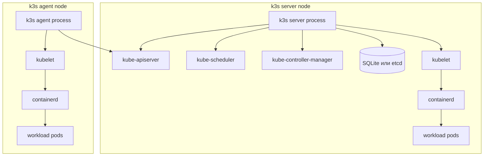
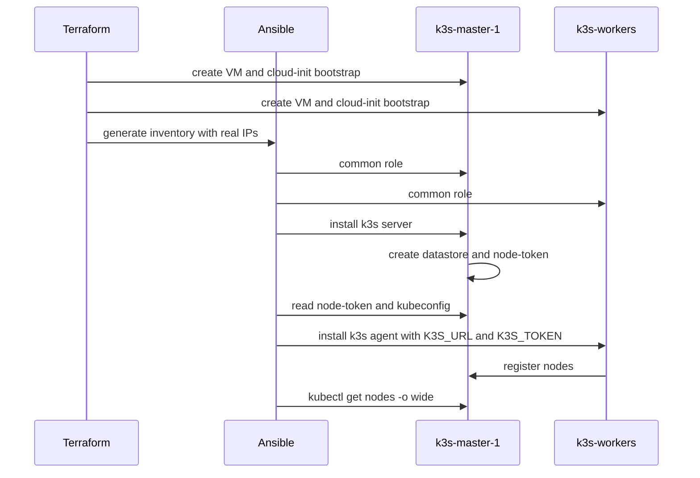
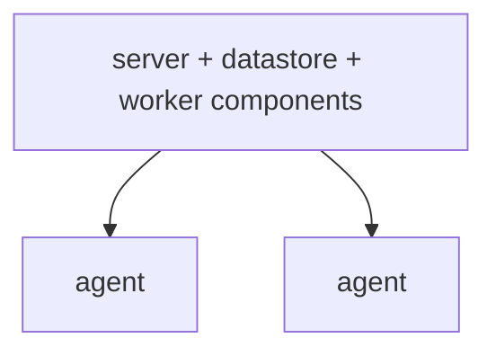
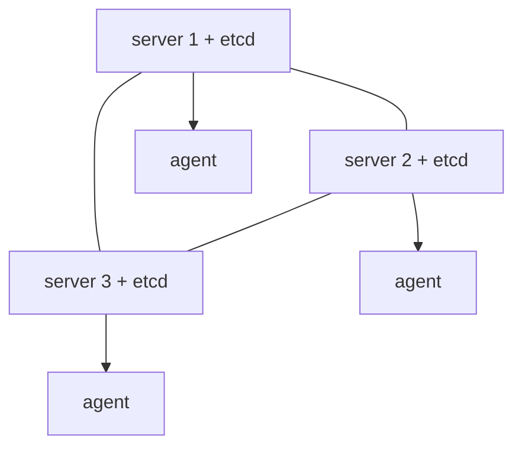
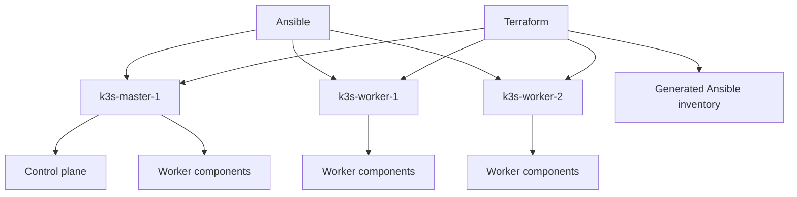

# Архитектура K3s

## Оглавление

- [Кратко о Kubernetes](#кратко-о-kubernetes)
- [Kubernetes API objects](#kubernetes-api-objects)
- [Что такое K3s](#что-такое-k3s)
- [Server и agent nodes](#server-и-agent-nodes)
- [Server node как worker](#server-node-как-worker)
- [Control plane](#control-plane)
- [Node plane](#node-plane)
- [Datastore](#datastore)
- [Bootstrap](#bootstrap)
- [Конфигурация запуска](#конфигурация-запуска)
- [Packaged components и addons](#packaged-components-и-addons)
- [High Availability](#high-availability)
- [Архитектура текущего проекта](#архитектура-текущего-проекта)

## Кратко о Kubernetes

Kubernetes — это control loop вокруг желаемого состояния. Администратор или CI/CD отправляет в API описание того, что должно существовать: приложения, сервисы, конфигурация, секреты, volumes, ingress rules, policies. Control plane сохраняет это состояние и через controllers, scheduler и kubelet приводит реальные nodes к нужному виду.

Kubernetes решает задачи:

- запуск container workloads;
- self-healing при падении Pod или node;
- service discovery;
- rollout и rollback;
- управление конфигурацией и секретами;
- scheduling по узлам;
- абстракция сети;
- абстракция storage;
- горизонтальное масштабирование;
- декларативное управление инфраструктурой приложений.

Важно: Kubernetes не запускает «контейнеры напрямую». Он управляет API objects. Контейнеры появляются как следствие того, что kubelet получил PodSpec и попросил container runtime запустить containers.

## Kubernetes API objects

Pod и Deployment — только часть модели. В реальном кластере встречается много сущностей.

### Workloads

| Сущность | Назначение |
|---|---|
| `Pod` | Минимальная единица запуска. Обычно содержит один основной container и опциональные sidecars. |
| `ReplicaSet` | Поддерживает нужное количество одинаковых Pod. Обычно создаётся Deployment. |
| `Deployment` | Управляет ReplicaSet, rollout, rollback и rolling updates для stateless workloads. |
| `StatefulSet` | Управляет stateful workloads с устойчивыми именами Pod и постоянными volumes. |
| `DaemonSet` | Запускает Pod на каждой подходящей node. Типично: agents, log collectors, CNI components. |
| `Job` | Одноразовая задача до успешного завершения. |
| `CronJob` | Периодический запуск Job по расписанию. |

### Networking

| Сущность | Назначение |
|---|---|
| `Service` | Стабильная точка доступа к группе Pod. Типы: `ClusterIP`, `NodePort`, `LoadBalancer`, `ExternalName`. |
| `EndpointSlice` | Реальный список backend endpoints для Service. |
| `Ingress` | HTTP/HTTPS routing к Services через ingress controller. |
| `IngressClass` | Выбор ingress controller для Ingress. |
| `NetworkPolicy` | Правила сетевого доступа между Pod, если CNI поддерживает policy. |

### Configuration and identity

| Сущность | Назначение |
|---|---|
| `ConfigMap` | Несекретная конфигурация. |
| `Secret` | Секретные данные. Base64 — это кодирование, не шифрование. |
| `ServiceAccount` | Идентичность Pod внутри Kubernetes API. |
| `Role` / `ClusterRole` | Набор прав. |
| `RoleBinding` / `ClusterRoleBinding` | Привязка прав к пользователю, группе или ServiceAccount. |

### Storage

| Сущность | Назначение |
|---|---|
| `PersistentVolume` | Реальный или динамически созданный volume. |
| `PersistentVolumeClaim` | Запрос приложения на volume. |
| `StorageClass` | Правила динамического создания volumes. |
| `VolumeSnapshot` | Snapshot volume, если установлен CSI snapshot controller. |

### Scheduling and policy

| Сущность | Назначение |
|---|---|
| `Node` | Kubernetes-представление VM/host. |
| `Namespace` | Логическое разделение ресурсов. |
| `ResourceQuota` | Ограничения ресурсов на namespace. |
| `LimitRange` | Default/min/max resources для Pod/containers. |
| `PriorityClass` | Приоритет scheduling и eviction. |
| `RuntimeClass` | Выбор container runtime handler, если доступно несколько runtime. |
| `PodDisruptionBudget` | Ограничение добровольных disruptions при drain/upgrade. |

### Extensibility

| Сущность | Назначение |
|---|---|
| `CustomResourceDefinition` | Добавляет новые типы объектов в Kubernetes API. |
| `CustomResource` | Экземпляр типа, добавленного через CRD. |
| `Controller` / `Operator` | Логика, которая наблюдает API objects и приводит внешний или внутренний ресурс к нужному состоянию. |
| `HelmChart` | K3s-specific CRD для установки packaged Helm charts из manifest-директории. |
| `HelmChartConfig` | K3s-specific CRD для переопределения values packaged Helm charts, например Traefik. |

## Что такое K3s

K3s — облегчённый Kubernetes-дистрибутив от Rancher/SUSE. Он оставляет стандартный Kubernetes API, но упрощает установку и эксплуатацию.

Ключевые отличия:

- один binary `k3s`;
- простой install script;
- bundled `containerd`;
- встроенный supervisor/tunnel для связи agents с server;
- SQLite по умолчанию для single-server;
- embedded etcd для HA;
- packaged components: CoreDNS, metrics-server, local-path-provisioner, Traefik, ServiceLB;
- автоматическая установка манифестов из `/var/lib/rancher/k3s/server/manifests`;
- меньше внешних зависимостей по сравнению с kubeadm-based установкой.

K3s остаётся Kubernetes: `kubectl`, YAML manifests, Helm charts, RBAC, CRD, operators и controllers работают привычным образом.

## Server и agent nodes


```mermaid
flowchart TD
    subgraph ServerNode[k3s server node]
        K3SS[k3s server process]
        API[kube-apiserver]
        SCH[kube-scheduler]
        CM[kube-controller-manager]
        DS[(SQLite или etcd)]
        KL1[kubelet]
        CT1[containerd]
        Pods1[workload pods]
    end

    subgraph AgentNode[k3s agent node]
        K3SA[k3s agent process]
        KL2[kubelet]
        CT2[containerd]
        Pods2[workload pods]
    end

    K3SS --> API
    K3SS --> SCH
    K3SS --> CM
    K3SS --> DS
    K3SS --> KL1
    KL1 --> CT1
    CT1 --> Pods1

    K3SA --> KL2
    KL2 --> CT2
    CT2 --> Pods2
    K3SA --> API
```

`k3s server` запускает control plane и, по умолчанию, worker-компоненты. `k3s agent` запускает node-компоненты и подключается к server.

## Server node как worker

Да, K3s server node по умолчанию выступает и как worker node. Это означает, что на server node есть:

- `kubelet`;
- `containerd`;
- CNI configuration;
- Pod networking;
- возможность запускать workload Pods;
- системные Pods `kube-system`.

В небольшом lab-кластере это удобно: одна VM может быть и control plane, и compute node. В production или более строгих окружениях control-plane nodes часто отделяют от workloads.

Ограничить запуск пользовательских workloads на server node можно taint-ом:

```bash
kubectl taint nodes <server-node> node-role.kubernetes.io/control-plane=true:NoSchedule
```

Вернуть scheduling:

```bash
kubectl taint nodes <server-node> node-role.kubernetes.io/control-plane-
```

В текущем проекте server node оставлен schedulable, потому что кластер небольшой и ресурсы хоста ограничены.

## Control plane

Control plane отвечает за API и управление желаемым состоянием.

| Компонент | Роль |
|---|---|
| `kube-apiserver` | Центральная API-точка. Все операции проходят через него. |
| `kube-scheduler` | Выбирает node для Pod с учётом ресурсов, taints, affinity, topology и constraints. |
| `kube-controller-manager` | Запускает controllers: Deployment, Node, Job, endpoints, namespace и другие. |
| `cloud-controller-manager` | В K3s обычно встроен/упрощён; полноценный cloud provider в homelab часто отсутствует. |
| `datastore` | Хранит состояние Kubernetes API. |

K3s упаковывает эти компоненты в один процесс `k3s server`, но логически это те же компоненты Kubernetes.

## Node plane

Node plane отвечает за запуск workload на конкретной VM.

| Компонент | Где работает | Назначение |
|---|---|---|
| `kubelet` | server и agent nodes | Получает PodSpec и следит за containers. |
| `containerd` | server и agent nodes | Скачивает images, запускает containers и sandboxes. |
| CNI plugin | server и agent nodes | Подключает Pod к cluster network. |
| kube-proxy replacement / service rules | nodes | Реализует Service routing через iptables/nftables. |

В K3s Docker не нужен. Container runtime уже входит в K3s как bundled `containerd`.

## Datastore

Datastore хранит состояние Kubernetes API.

| Вариант | Когда подходит |
|---|---|
| SQLite | Single-server lab, простая установка, минимум ресурсов. |
| Embedded etcd | HA control plane, минимум 3 server nodes. |
| External datastore | Внешний PostgreSQL/MySQL/etcd, когда datastore живёт отдельно от K3s nodes. |

Текущий проект использует single-server модель. Для lab это нормально, но server node остаётся single point of failure.

## Bootstrap


```mermaid
sequenceDiagram
    participant T as Terraform
    participant A as Ansible
    participant M as k3s-master-1
    participant W as k3s-workers

    T->>M: create VM and cloud-init bootstrap
    T->>W: create VM and cloud-init bootstrap
    T->>A: generate inventory with real IPs
    A->>M: common role
    A->>W: common role
    A->>M: install k3s server
    M->>M: create datastore and node-token
    A->>M: read node-token and kubeconfig
    A->>W: install k3s agent with K3S_URL and K3S_TOKEN
    W->>M: register nodes
    A->>M: kubectl get nodes -o wide
```

В проекте token не вводится вручную. Роль `k3s_server` читает token, а роль `k3s_agent` получает его через `hostvars`.

## Конфигурация запуска

K3s можно конфигурировать через:

- install script environment variables;
- аргументы `k3s server` или `k3s agent`;
- `/etc/rancher/k3s/config.yaml`;
- systemd unit environment files;
- manifests в `/var/lib/rancher/k3s/server/manifests`.

Пример server config:

```yaml
write-kubeconfig-mode: "0644"
node-name: k3s-master-1
disable:
  - servicelb
tls-san:
  - 192.168.31.174
```

Пример agent config:

```yaml
server: https://192.168.31.174:6443
token: <cluster-token>
node-name: k3s-worker-1
```

В текущей Ansible-реализации параметры передаются через `INSTALL_K3S_EXEC`, `K3S_URL` и `K3S_TOKEN`. Следующий более аккуратный шаг — генерировать `/etc/rancher/k3s/config.yaml` из templates.

## Packaged components и addons

K3s может автоматически устанавливать bundled manifests. Это удобно, но важно понимать, что часть поведения кластера уже задана K3s.

По умолчанию часто доступны:

- CoreDNS;
- metrics-server;
- local-path-provisioner;
- Traefik ingress controller;
- ServiceLB;
- Helm controller;
- Flannel CNI.

Отключение packaged component обычно делается через `--disable`:

```bash
k3s server --disable traefik --disable servicelb
```

В production-like homelab часто рассматривают:

- заменить ServiceLB на MetalLB;
- заменить или явно настроить Traefik;
- добавить cert-manager;
- добавить External Secrets Operator или Vault integration;
- добавить monitoring stack;
- добавить logging stack;
- добавить CSI storage, например Longhorn, NFS CSI или Ceph CSI.

## High Availability

### Single server


```mermaid
graph TD
    S1[server + datastore + worker components] --> A1[agent]
    S1 --> A2[agent]
```

Плюсы:

- простота;
- минимум ресурсов;
- подходит для lab и обучения.

Минусы:

- server node — single point of failure;
- datastore живёт на одной VM;
- upgrade server требует аккуратности.

### Multi-server с embedded etcd


```mermaid
graph TD
    S1[server 1 + etcd] --- S2[server 2 + etcd]
    S2 --- S3[server 3 + etcd]
    S1 --- S3
    S1 --> A1[agent]
    S2 --> A2[agent]
    S3 --> A3[agent]
```

Для embedded etcd нужен quorum. Обычно минимум 3 server nodes. Чётное количество server nodes не улучшает quorum так, как ожидают новички, и может усложнить отказоустойчивость.

Текущий проект HA не настраивает.

## Архитектура текущего проекта


```mermaid
flowchart TD
    TF[Terraform] --> VM1[k3s-master-1]
    TF --> VM2[k3s-worker-1]
    TF --> VM3[k3s-worker-2]
    TF --> INV[Generated Ansible inventory]

    ANS[Ansible] --> VM1
    ANS --> VM2
    ANS --> VM3

    VM1 --> CP[Control plane]
    VM1 --> NP1[Worker components]
    VM2 --> NP2[Worker components]
    VM3 --> NP3[Worker components]
```

Текущая модель:

- `k3s-master-1` — server node и одновременно worker node;
- `k3s-worker-1` и `k3s-worker-2` — agent nodes;
- Terraform создаёт VM и inventory;
- Ansible настраивает ОС и устанавливает K3s;
- kubeconfig сохраняется в `ansible/artifacts/k3s.yaml`;
- endpoint kubeconfig должен указывать на IP master, а не на `127.0.0.1`.
