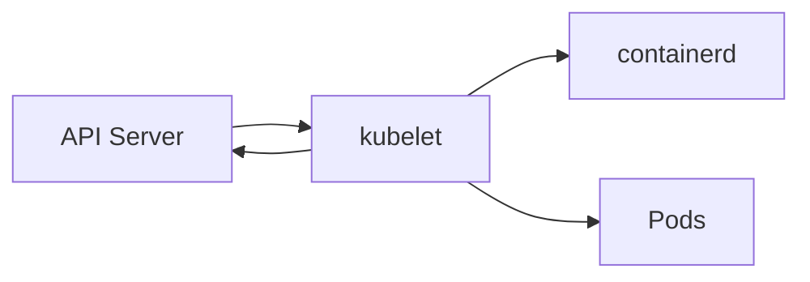

# Компоненты кластера K3s

## Оглавление

- [kubelet](#kubelet)
- [containerd](#containerd)
- [CoreDNS](#coredns)
- [metrics-server](#metrics-server)
- [local-path-provisioner](#local-path-provisioner)
- [Traefik](#traefik)
- [ServiceLB](#servicelb)

## kubelet

kubelet работает на каждом node. Он получает PodSpec от API Server и следит, чтобы нужные контейнеры были запущены.

Взаимодействия:



## containerd

containerd — container runtime, который скачивает images и запускает containers.

K3s поставляет containerd вместе с собой, поэтому Docker не нужен.

## CoreDNS

CoreDNS обеспечивает DNS внутри кластера.

Пример имени:

```text
my-service.default.svc.cluster.local
```

Pod обращается к Service по DNS, CoreDNS возвращает cluster IP.

## metrics-server

metrics-server собирает CPU/RAM метрики с kubelet. Он нужен для:

- `kubectl top nodes`;
- `kubectl top pods`;
- Horizontal Pod Autoscaler.

## local-path-provisioner

local-path-provisioner создаёт локальные директории на node для PersistentVolume.

Плюсы:

- работает из коробки;
- подходит для lab.

Минусы:

- данные привязаны к конкретной node;
- нет репликации;
- при потере node данные могут быть потеряны.

## Traefik

Traefik — ingress controller, который K3s устанавливает по умолчанию.

Он принимает HTTP/HTTPS трафик и направляет его к Kubernetes Services.

## ServiceLB

ServiceLB реализует LoadBalancer Services без внешнего cloud provider.

В homelab это удобно, но для production часто заменяют на MetalLB или внешний балансировщик.

