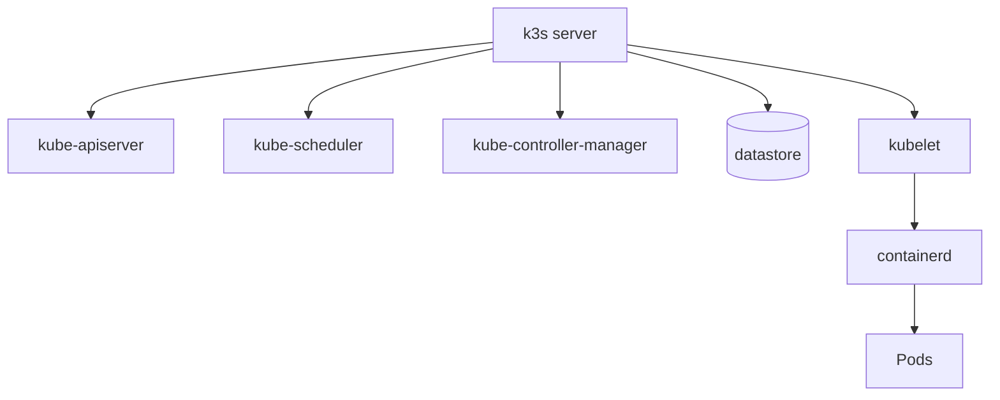
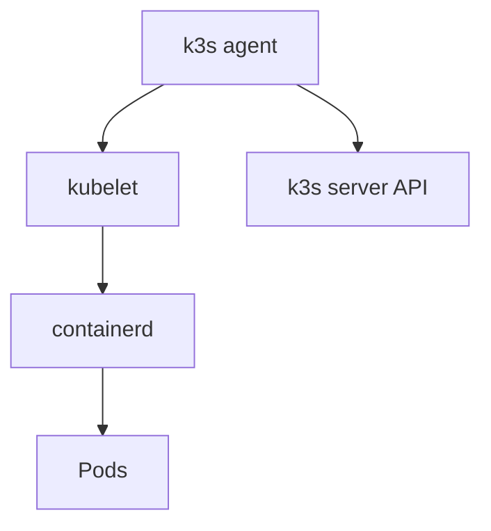

# Компоненты кластера K3s

## Оглавление

- [Компоненты server node](#компоненты-server-node)
- [Компоненты agent node](#компоненты-agent-node)
- [kubelet](#kubelet)
- [containerd](#containerd)
- [CNI и flannel](#cni-и-flannel)
- [CoreDNS](#coredns)
- [metrics-server](#metrics-server)
- [local-path-provisioner](#local-path-provisioner)
- [Traefik](#traefik)
- [ServiceLB](#servicelb)
- [Helm controller](#helm-controller)
- [Manifests directory](#manifests-directory)
- [Дополнительные addons](#дополнительные-addons)

## Компоненты server node

K3s server node запускает control plane и, если специально не ограничить scheduling, worker-компоненты.


```mermaid
flowchart TD
    KS[k3s server] --> API[kube-apiserver]
    KS --> SCH[kube-scheduler]
    KS --> CM[kube-controller-manager]
    KS --> DB[(datastore)]
    KS --> KUBELET[kubelet]
    KUBELET --> CT[containerd]
    CT --> PODS[Pods]
```

На server node есть:

- API Server;
- Scheduler;
- Controller Manager;
- datastore;
- kubelet;
- containerd;
- CNI;
- системные и пользовательские Pods.

## Компоненты agent node

Agent node не запускает control plane, но запускает workload.


```mermaid
flowchart TD
    KA[k3s agent] --> KUBELET[kubelet]
    KUBELET --> CT[containerd]
    CT --> PODS[Pods]
    KA --> API[k3s server API]
```

На agent node есть:

- `k3s-agent` systemd service;
- kubelet;
- containerd;
- CNI;
- workload Pods.

## kubelet

kubelet работает на каждой node, включая K3s server. Он:

- регистрирует node в API Server;
- получает PodSpec;
- вызывает container runtime через CRI;
- монтирует volumes;
- запускает liveness/readiness/startup probes;
- сообщает status Pod и node в API Server.

Диагностика:

```bash
sudo journalctl -u k3s -n 200
sudo journalctl -u k3s-agent -n 200
sudo k3s kubectl describe node <node>
```

## containerd

containerd — container runtime. Он:

- скачивает images;
- управляет snapshots/layers;
- запускает containers;
- работает с pause containers;
- отдаёт status kubelet.

K3s поставляет containerd вместе с собой, поэтому Docker не нужен.

Полезные команды на node:

```bash
sudo k3s crictl ps
sudo k3s crictl images
sudo k3s crictl logs <container-id>
```

## CNI и flannel

CNI подключает Pod к сети. K3s по умолчанию использует flannel.

Flannel обычно создаёт overlay network между nodes и позволяет Pod на разных VM общаться напрямую через Pod CIDR.

Что важно:

- на nodes должны быть загружены `overlay` и `br_netfilter`;
- sysctl должен разрешать forwarding;
- firewall между nodes не должен ломать overlay traffic;
- Pod CIDR и Service CIDR не должны конфликтовать с домашней LAN.

## CoreDNS

CoreDNS обеспечивает DNS внутри кластера.

Пример:

```text
my-service.default.svc.cluster.local
```

Если CoreDNS сломан, приложения часто выглядят так, будто у них «не работает сеть». На практике проблема может быть только в DNS.

Диагностика:

```bash
sudo k3s kubectl -n kube-system get pods -l k8s-app=kube-dns
sudo k3s kubectl -n kube-system logs deploy/coredns
```

## metrics-server

metrics-server собирает resource metrics с kubelet.

Нужен для:

- `kubectl top nodes`;
- `kubectl top pods`;
- Horizontal Pod Autoscaler.

metrics-server не является полноценной системой мониторинга. Для истории, dashboards и alerting нужен Prometheus/Grafana или аналог.

## local-path-provisioner

local-path-provisioner создаёт локальные директории на node для PersistentVolume.

Плюсы:

- работает из коробки;
- подходит для lab;
- не требует внешнего storage.

Минусы:

- данные привязаны к конкретной node;
- нет репликации;
- при потере node данные могут быть потеряны;
- Pod с volume может не переехать на другую node без ручного вмешательства.

## Traefik

Traefik — ingress controller, который K3s устанавливает по умолчанию.

Он принимает HTTP/HTTPS трафик и направляет его к Kubernetes Services на основании `Ingress` или CRD Traefik.

Проверка:

```bash
sudo k3s kubectl -n kube-system get deploy,svc | grep traefik
sudo k3s kubectl get ingressclass
```

Traefik можно:

- оставить как default ingress controller;
- настроить через `HelmChartConfig`;
- отключить и заменить на ingress-nginx.

## ServiceLB

ServiceLB реализует `Service` типа `LoadBalancer` без внешнего cloud provider.

В homelab это удобно, но есть ограничения:

- нет полноценной BGP/L2 announcement-модели как у MetalLB;
- поведение зависит от node ports и доступности node IP;
- для более предсказуемого LoadBalancer в LAN часто выбирают MetalLB.

Отключение:

```bash
k3s server --disable servicelb
```

## Helm controller

K3s включает Helm controller. Он обрабатывает CRD:

- `HelmChart`;
- `HelmChartConfig`.

K3s использует это для packaged charts, например Traefik.

Типичный путь:

```text
/var/lib/rancher/k3s/server/manifests/
```

Если положить туда manifest, K3s применит его автоматически. Это удобно для bootstrap addons, но требует дисциплины: файлы в этой директории становятся частью состояния кластера.

## Manifests directory

K3s server автоматически применяет YAML из:

```text
/var/lib/rancher/k3s/server/manifests
```

Использовать можно для:

- базовых namespaces;
- HelmChart resources;
- HelmChartConfig для Traefik;
- bootstrap addons.

Антипаттерн: вручную править generated manifests без документации. Лучше управлять ими через Ansible templates или GitOps.

## Дополнительные addons

Полезные дополнительные компоненты для дальнейшего развития проекта:

| Addon | Назначение |
|---|---|
| cert-manager | Выпуск TLS certificates через ACME или внутренний CA. |
| MetalLB | LoadBalancer Services в bare-metal/LAN окружении. |
| External Secrets Operator | Синхронизация секретов из Vault/других secret stores. |
| Vault CSI Provider | Монтирование секретов Vault в Pods. |
| Longhorn | Distributed block storage для Kubernetes. |
| kube-prometheus-stack | Prometheus, Alertmanager, Grafana dashboards. |
| Loki/Promtail | Централизованное логирование. |
| Argo CD или Flux | GitOps delivery. |

Внедрять addons лучше по одному: установить, описать values, проверить backup/restore и только потом переходить к следующему.
