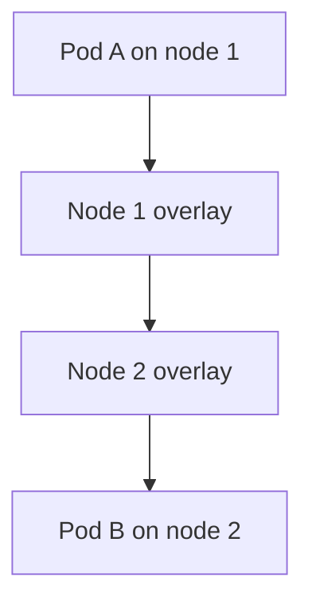
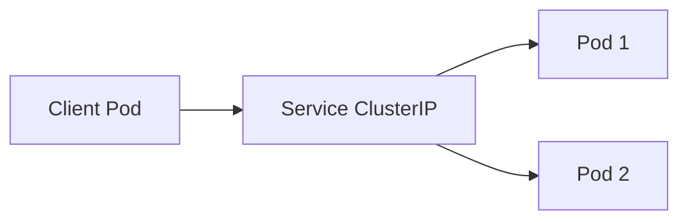

# Сеть в K3s

## Оглавление

- [Pod Network](#pod-network)
- [Service Network](#service-network)
- [Cluster DNS](#cluster-dns)
- [CNI](#cni)
- [Ingress](#ingress)
- [Устранение неполадок](#устранение-неполадок)

## Pod Network

Pod Network позволяет Pod на разных nodes общаться друг с другом.



K3s по умолчанию использует flannel. Он создаёт overlay network между nodes.

## Service Network

Service даёт стабильный адрес для группы Pod.



Pod могут пересоздаваться и менять IP, но Service остаётся стабильным.

## Cluster DNS

CoreDNS создаёт DNS-записи для Services:

```text
service.namespace.svc.cluster.local
```

Если DNS не работает, приложения часто выглядят как «сеть сломалась», хотя проблема в резолвинге.

## CNI

CNI — интерфейс, через который Kubernetes подключает Pod к сети.

K3s default:

- flannel как CNI;
- VXLAN backend в типовой конфигурации;
- iptables/nftables правила для service routing.

## Ingress

Ingress описывает HTTP routing:

```yaml
apiVersion: networking.k8s.io/v1
kind: Ingress
metadata:
  name: app
spec:
  rules:
    - host: app.example.local
      http:
        paths:
          - path: /
            pathType: Prefix
            backend:
              service:
                name: app
                port:
                  number: 80
```

В K3s по умолчанию установлен Traefik.

## Устранение неполадок

| Симптом | Диагностика | Решение |
|---|---|---|
| Pod не резолвит Service | `kubectl -n kube-system logs deploy/coredns` | проверить CoreDNS |
| Node NotReady из-за CNI | `journalctl -u k3s` | проверить flannel и kernel modules |
| Service недоступен | `kubectl get endpoints` | проверить selector и ready Pods |
| Ingress не отвечает | `kubectl get ingress,svc -A` | проверить Traefik и DNS снаружи |
