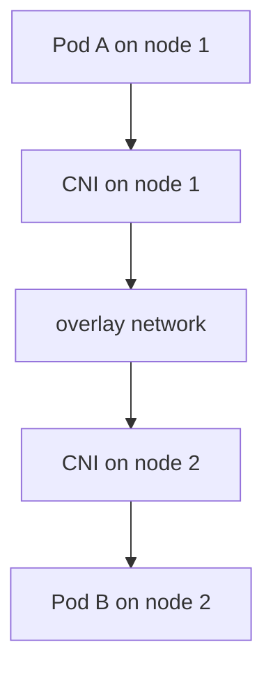
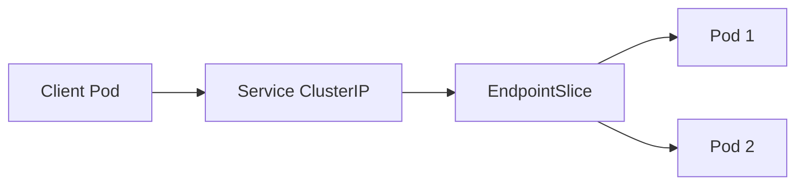

# Сеть в K3s

## Оглавление

- [Сетевые уровни](#сетевые-уровни)
- [Pod Network](#pod-network)
- [Service Network](#service-network)
- [Cluster DNS](#cluster-dns)
- [CNI и flannel](#cni-и-flannel)
- [NetworkPolicy](#networkpolicy)
- [Ingress](#ingress)
- [LoadBalancer Services](#loadbalancer-services)
- [NodePort](#nodeport)
- [DNS и внешний доступ](#dns-и-внешний-доступ)
- [Firewall и маршрутизация](#firewall-и-маршрутизация)
- [Устранение неполадок](#устранение-неполадок)

## Сетевые уровни

В Kubernetes есть несколько разных сетевых уровней. Их важно не смешивать.

| Уровень | Что означает |
|---|---|
| Node network | IP-адреса VM в Proxmox/LAN, например `192.168.31.x`. |
| Pod network | IP-адреса Pod, обычно из отдельного CIDR. |
| Service network | Virtual IP для Services, не равен IP Pod или node. |
| Ingress | HTTP/HTTPS routing на уровне доменных имён и путей. |
| LoadBalancer | Внешний IP для Service, если есть ServiceLB/MetalLB/cloud provider. |

## Pod Network

Pod Network позволяет Pod на разных nodes общаться друг с другом.


```mermaid
graph TD
    P1[Pod A on node 1] --> CNI1[CNI on node 1]
    CNI1 --> OVERLAY[overlay network]
    OVERLAY --> CNI2[CNI on node 2]
    CNI2 --> P2[Pod B on node 2]
```

K3s по умолчанию использует flannel. Он создаёт overlay network между nodes.

Практические требования:

- nodes должны видеть друг друга по LAN;
- firewall не должен блокировать traffic между nodes;
- Pod CIDR не должен конфликтовать с LAN;
- kernel modules и sysctl должны быть настроены.

## Service Network

Service даёт стабильный адрес для группы Pod.


```mermaid
flowchart LR
    C[Client Pod] --> S[Service ClusterIP]
    S --> E[EndpointSlice]
    E --> P1[Pod 1]
    E --> P2[Pod 2]
```

Pod могут пересоздаваться и менять IP, но Service остаётся стабильным.

Типы Service:

| Тип | Назначение |
|---|---|
| `ClusterIP` | Доступ только внутри кластера. |
| `NodePort` | Порт открывается на каждой node. |
| `LoadBalancer` | Внешний IP через ServiceLB, MetalLB или cloud provider. |
| `ExternalName` | DNS alias на внешний адрес. |

## Cluster DNS

CoreDNS создаёт DNS-записи для Services:

```text
service.namespace.svc.cluster.local
```

Примеры:

```text
api.default.svc.cluster.local
postgres.database.svc.cluster.local
```

Если DNS не работает, приложения часто выглядят как «сеть сломалась», хотя проблема в резолвинге.

Проверка:

```bash
sudo k3s kubectl -n kube-system logs deploy/coredns
sudo k3s kubectl run dns-test --rm -it --image=busybox:1.36 -- nslookup kubernetes.default
```

## CNI и flannel

CNI — интерфейс, через который Kubernetes подключает Pod к сети.

K3s default:

- flannel как CNI;
- VXLAN backend в типовой конфигурации;
- iptables/nftables правила для service routing.

Flannel подходит для простого homelab. Если нужны NetworkPolicy, advanced routing или eBPF, обычно смотрят на Cilium или Calico, но это усложняет эксплуатацию.

## NetworkPolicy

`NetworkPolicy` ограничивает сетевой доступ между Pod. Важно: сама сущность Kubernetes есть всегда, но её enforcement зависит от CNI.

Если CNI не поддерживает NetworkPolicy, объект может существовать, но фактически ничего не ограничивать.

Для проекта это означает:

- сначала проверить возможности выбранного CNI;
- затем вводить политики постепенно;
- не считать YAML `NetworkPolicy` достаточной защитой без проверки.

## Ingress

Ingress описывает HTTP routing:

```yaml
apiVersion: networking.k8s.io/v1
kind: Ingress
metadata:
  name: app
spec:
  ingressClassName: traefik
  rules:
    - host: app.example.local
      http:
        paths:
          - path: /
            pathType: Prefix
            backend:
              service:
                name: app
                port:
                  number: 80
```

В K3s по умолчанию установлен Traefik.

Ingress сам по себе не открывает магический внешний IP. Нужны:

- ingress controller;
- Service для ingress controller;
- внешний DNS или hosts-запись;
- route/firewall до node или LoadBalancer IP.

## LoadBalancer Services

K3s включает ServiceLB. Он позволяет использовать Service типа `LoadBalancer` без cloud provider.

Для homelab альтернативой часто становится MetalLB:

- ServiceLB проще и уже встроен;
- MetalLB предсказуемее для LAN и даёт отдельный pool IP-адресов.

Если планируется несколько внешних сервисов, лучше заранее решить, оставлять ServiceLB или переходить на MetalLB.

## NodePort

NodePort открывает порт на каждой node:

```text
http://<node-ip>:<node-port>
```

Плюсы:

- просто проверить сервис;
- не нужен LoadBalancer.

Минусы:

- неудобные порты;
- хуже управляемость;
- не лучший вариант для постоянного user-facing доступа.

## DNS и внешний доступ

Для homelab есть варианты:

- записи в локальном DNS;
- записи в `/etc/hosts`;
- wildcard DNS на локальный домен;
- split-horizon DNS;
- внешний домен с private records.

Пример:

```text
app.home.arpa -> 192.168.31.174
grafana.home.arpa -> 192.168.31.174
```

Если используется LoadBalancer pool, DNS должен указывать на LoadBalancer IP.

## Firewall и маршрутизация

Минимально nodes должны иметь:

- доступ workers к master `:6443`;
- связь между nodes для Pod overlay;
- DNS/HTTP(S) наружу для скачивания images;
- доступ администратора к API/kubeconfig endpoint.

Если включается firewall, изменения нужно проверять командой:

```bash
sudo k3s kubectl get nodes -o wide
sudo k3s kubectl get pods -A
sudo k3s kubectl get endpoints -A
```

## Устранение неполадок

| Симптом | Диагностика | Решение |
|---|---|---|
| Pod не резолвит Service | `kubectl -n kube-system logs deploy/coredns` | проверить CoreDNS |
| Node NotReady из-за CNI | `journalctl -u k3s` | проверить flannel, kernel modules и sysctl |
| Service недоступен | `kubectl get endpointslice,endpoints` | проверить selector и ready Pods |
| Ingress не отвечает | `kubectl get ingress,svc -A` | проверить Traefik, DNS и внешний route |
| LoadBalancer pending | `kubectl get svc -A` | проверить ServiceLB/MetalLB |
| Worker не подключается | `curl -k https://<master-ip>:6443` | проверить firewall, token и inventory |
