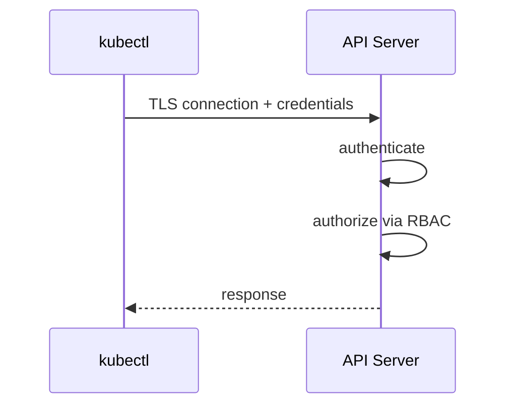

# Безопасность K3s

## Оглавление

- [TLS и сертификаты](#tls-и-сертификаты)
- [Service Accounts](#service-accounts)
- [RBAC](#rbac)
- [Secrets](#secrets)
- [kubeconfig](#kubeconfig)
- [Лучшие практики](#лучшие-практики)

## TLS и сертификаты

Kubernetes компоненты общаются по TLS. API Server проверяет клиентов через сертификаты или bearer tokens.



## Service Accounts

ServiceAccount — идентичность workload внутри кластера. Pod может использовать token service account для обращения к API.

## RBAC

RBAC отвечает на вопрос: «что этот субъект может делать?».

Сущности:

- Role;
- ClusterRole;
- RoleBinding;
- ClusterRoleBinding.

Пример:

```yaml
kind: Role
apiVersion: rbac.authorization.k8s.io/v1
metadata:
  name: pod-reader
rules:
  - apiGroups: [""]
    resources: ["pods"]
    verbs: ["get", "list", "watch"]
```

## Secrets

Secret хранит чувствительные данные в Kubernetes API. По умолчанию значения base64-encoded, но это не шифрование.

Для production важно включать encryption at rest или использовать external secrets.

## kubeconfig

kubeconfig содержит:

- адрес API Server;
- CA data;
- credentials пользователя;
- context.

В проекте kubeconfig сохраняется Ansible в:

```text
ansible/artifacts/k3s.yaml
```

Этот файл нельзя публиковать.

## Лучшие практики

- Не коммитить kubeconfig.
- Ограничивать RBAC по принципу least privilege.
- Не использовать default service account для приложений.
- Не хранить секреты в plain YAML.
- Проверять права `ClusterRoleBinding`.
- Защищать SSH-доступ к nodes.
- Регулярно обновлять K3s.
