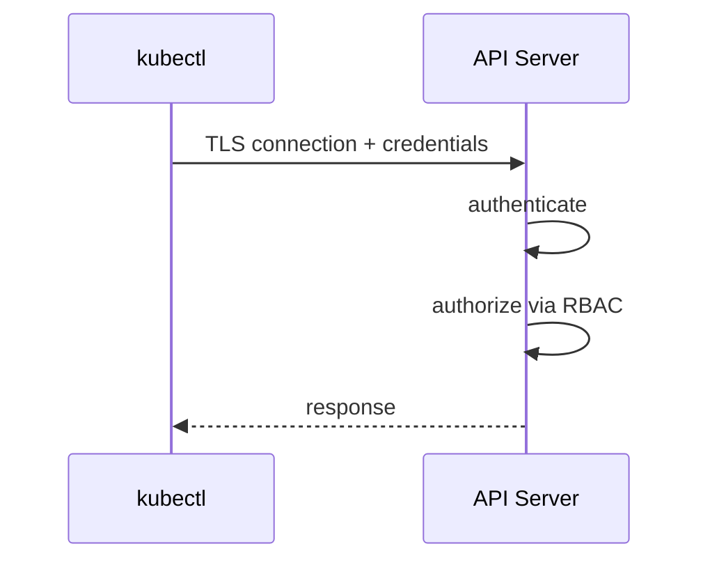

# Безопасность K3s

## Оглавление

- [Модель безопасности](#модель-безопасности)
- [TLS и сертификаты](#tls-и-сертификаты)
- [kubeconfig](#kubeconfig)
- [Service Accounts](#service-accounts)
- [RBAC](#rbac)
- [Secrets](#secrets)
- [Node security](#node-security)
- [Network security](#network-security)
- [Pod security](#pod-security)
- [Supply chain](#supply-chain)
- [Лучшие практики](#лучшие-практики)

## Модель безопасности

Безопасность Kubernetes складывается из нескольких уровней:

- доступ к VM;
- доступ к Kubernetes API;
- RBAC внутри кластера;
- безопасность container images;
- runtime isolation;
- network policies;
- secret management;
- backup и incident recovery.

K3s упрощает установку, но не отменяет эти уровни.

## TLS и сертификаты

Kubernetes компоненты общаются по TLS. API Server проверяет клиентов через сертификаты или bearer tokens.


```mermaid
sequenceDiagram
    participant K as kubectl
    participant A as API Server
    K->>A: TLS connection + credentials
    A->>A: authenticate
    A->>A: authorize via RBAC
    A-->>K: response
```

Важно:

- время на nodes должно быть синхронизировано;
- kubeconfig endpoint должен совпадать с сертификатом API Server;
- для внешнего доступа к API полезно задавать `tls-san`;
- сертификаты имеют срок жизни и требуют мониторинга.

## kubeconfig

kubeconfig содержит:

- адрес API Server;
- CA data;
- credentials пользователя;
- context.

В проекте kubeconfig сохраняется Ansible в:

```text
ansible/artifacts/k3s.yaml
```

Этот файл нельзя публиковать. Обычно он даёт административный доступ к кластеру.

В проекте Ansible заменяет `127.0.0.1` в kubeconfig на IP master, чтобы `kubectl` с рабочей станции подключался к API Server.

## Service Accounts

ServiceAccount — идентичность workload внутри кластера. Pod может использовать token service account для обращения к API.

Практики:

- не использовать `default` ServiceAccount для приложений;
- создавать отдельный ServiceAccount на приложение;
- выдавать минимальные права через Role/RoleBinding;
- отключать automount token там, где Pod не нужен доступ к API.

Пример:

```yaml
apiVersion: v1
kind: ServiceAccount
metadata:
  name: app
automountServiceAccountToken: false
```

## RBAC

RBAC отвечает на вопрос: «что этот субъект может делать?».

Сущности:

- `Role`;
- `ClusterRole`;
- `RoleBinding`;
- `ClusterRoleBinding`.

Пример:

```yaml
kind: Role
apiVersion: rbac.authorization.k8s.io/v1
metadata:
  name: pod-reader
rules:
  - apiGroups: [""]
    resources: ["pods"]
    verbs: ["get", "list", "watch"]
```

Проверка прав:

```bash
sudo k3s kubectl auth can-i list pods
sudo k3s kubectl auth can-i delete pods --as system:serviceaccount:default:app
```

## Secrets

Secret хранит чувствительные данные в Kubernetes API. По умолчанию значения base64-encoded, но это не шифрование.

Для production важно:

- включать encryption at rest;
- использовать external secrets;
- не хранить секреты в plain YAML;
- ограничивать RBAC на чтение Secrets;
- не писать секреты в logs.

В будущем проект планирует Vault. Тогда можно рассмотреть:

- External Secrets Operator;
- Vault Agent Injector;
- Secrets Store CSI Driver;
- Vault PKI для TLS certificates.

## Node security

Node — это VM с root-доступом к kubelet/container runtime. Компрометация node часто означает компрометацию workload на этой node.

Практики:

- SSH только по ключам;
- минимальные sudo-права;
- регулярные security updates;
- firewall;
- ограничение доступа к kubelet ports;
- мониторинг системных logs;
- защита `/etc/rancher/k3s` и `/var/lib/rancher/k3s`.

## Network security

Минимально:

- API Server `6443` должен быть доступен только администраторам и worker nodes;
- node-to-node traffic должен быть разрешён только внутри доверенной сети;
- Ingress/LoadBalancer должны открывать только нужные сервисы;
- административные панели не стоит публиковать без auth/TLS.

NetworkPolicy требует CNI с enforcement. Перед использованием нужно проверить, поддерживает ли текущая CNI-конфигурация реальные ограничения.

## Pod security

Риски:

- privileged containers;
- hostPath mounts;
- hostNetwork;
- root containers;
- capabilities сверх необходимости;
- images без pinning;
- отсутствие resource limits.

Базовые практики:

- запускать containers от non-root пользователя;
- задавать `readOnlyRootFilesystem`, если возможно;
- ограничивать capabilities;
- избегать privileged mode;
- задавать requests/limits;
- использовать namespaces и RBAC.

## Supply chain

Для Helm charts и images:

- фиксировать версии charts;
- фиксировать image tags или digest;
- проверять источник charts;
- не применять случайные manifests из интернета без review;
- хранить values в Git, а секреты — отдельно.

## Лучшие практики

- Не коммитить kubeconfig.
- Ограничивать RBAC по принципу least privilege.
- Не использовать default service account для приложений.
- Не хранить секреты в plain YAML.
- Проверять права `ClusterRoleBinding`.
- Защищать SSH-доступ к nodes.
- Регулярно обновлять K3s.
- Делать backup до upgrade.
- Явно документировать, какие addons имеют cluster-wide permissions.
