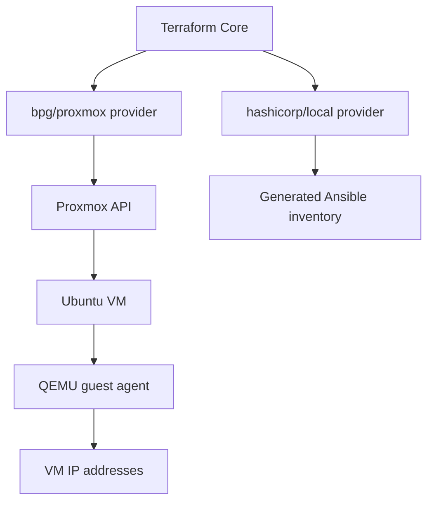

# Terraform: обзор раздела

Terraform используется в проекте как инструмент Infrastructure as Code для создания виртуальных машин в Proxmox VE и генерации Ansible inventory.

## Что изучить

1. [Фундаментальные концепции](fundamentals.md)
2. [State и backend](state.md)
3. [Providers](providers.md)
4. [Modules](modules.md)
5. [Workflows](workflows.md)
6. [Лучшие практики и антипаттерны](best-practices.md)
7. [Устранение неполадок](troubleshooting.md)

## Роль Terraform в текущем проекте

Terraform отвечает только за инфраструктуру:

- загрузка Ubuntu cloud image в Proxmox;
- создание cloud-init snippets;
- создание VM;
- ожидание IP через QEMU guest agent;
- генерация `ansible/inventories/generated/hosts.yml`;
- публикация outputs.

Terraform не устанавливает K3s и не настраивает ОС после bootstrap. Это зона ответственности Ansible.

## Основные файлы проекта

| Файл | Назначение |
|---|---|
| `providers.tf` | версии Terraform и providers |
| `variables.tf` | входные параметры |
| `main.tf` | Proxmox resources и inventory generation |
| `outputs.tf` | значения после apply |
| `terraform.tfvars` | локальные значения переменных |
| `.terraform.lock.hcl` | зафиксированные версии providers |
| `terraform.tfstate` | локальное состояние инфраструктуры |
