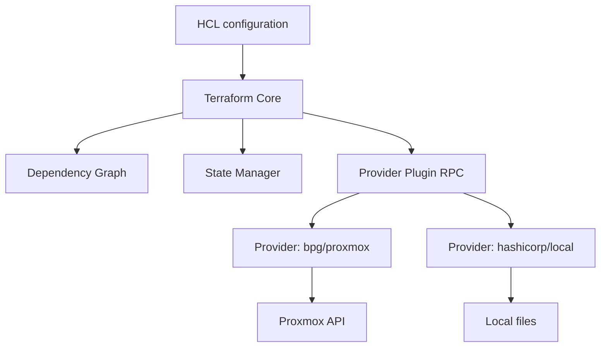
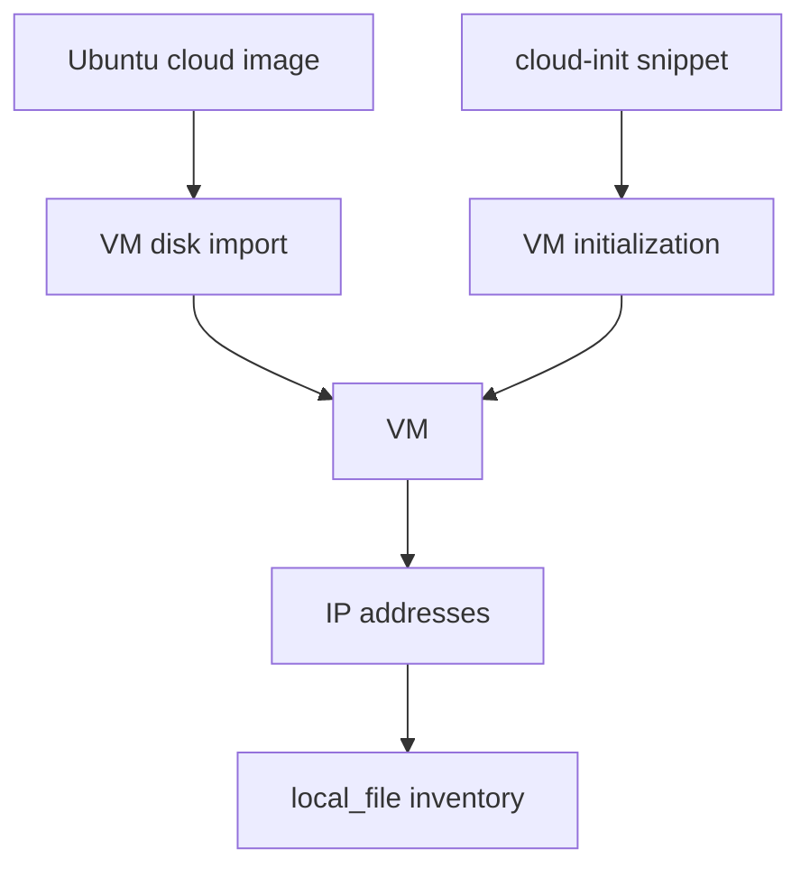

# Terraform: фундаментальные концепции

## Оглавление

- [Назначение Terraform](#назначение-terraform)
- [Infrastructure as Code](#infrastructure-as-code)
- [Архитектура Terraform](#архитектура-terraform)
- [Resources](#resources)
- [Variables и locals](#variables-и-locals)
- [Outputs](#outputs)
- [Data sources](#data-sources)
- [Dependency graph](#dependency-graph)
- [Пример из проекта](#пример-из-проекта)

## Назначение Terraform

Terraform решает задачу воспроизводимого управления инфраструктурой. Вместо ручного создания VM, сетей и дисков администратор описывает желаемое состояние в HCL-файлах. Terraform сравнивает это состояние с реальной инфраструктурой и строит план изменений.

В этом проекте Terraform создаёт Proxmox VM для будущего K3s-кластера и генерирует inventory для Ansible.

## Infrastructure as Code

Infrastructure as Code переводит инфраструктуру в код:

```hcl
resource "proxmox_virtual_environment_vm" "k3s" {
  name      = "k3s-master-1"
  node_name = var.proxmox_node
}
```

Преимущества IaC:

| Преимущество | Практический эффект |
|---|---|
| Версионирование | изменения видны в Git |
| Повторяемость | окружение можно пересоздать |
| Review | инфраструктурные изменения можно проверять |
| Автоматизация | apply выполняет API-вызовы вместо ручных кликов |
| Документированность | код показывает фактическую архитектуру |

## Архитектура Terraform



### Terraform Core

Terraform Core читает конфигурацию, вычисляет выражения, строит граф зависимостей, сравнивает desired state с current state и вызывает providers.

### Providers

Provider реализует работу с конкретной системой. Terraform Core не знает, как создать VM в Proxmox; это знает `bpg/proxmox`.

### State

State хранит связь между Terraform-адресом ресурса и реальным объектом. Например:

```text
module.k3s_vms["k3s-master-1"].proxmox_virtual_environment_vm.vm -> VMID 300
```

## Resources

Resource — управляемый объект инфраструктуры.

Примеры:

```hcl
resource "proxmox_download_file" "ubuntu_cloud_image" {}
resource "proxmox_virtual_environment_vm" "vm" {}
resource "local_file" "ansible_inventory" {}
```

### count

`count` создаёт несколько однотипных ресурсов по индексу:

```hcl
resource "example" "vm" {
  count = 3
}
```

Минус: удаление элемента в середине списка может сместить индексы.

### for_each

`for_each` создаёт ресурсы по стабильным ключам:

```hcl
resource "proxmox_virtual_environment_vm" "k3s" {
  for_each = local.vms
  name     = each.value.name
}
```

В проекте используется `for_each`, потому что имя VM является стабильным ключом.

### depends_on

Terraform обычно выводит зависимости из ссылок. `depends_on` нужен только для неявных зависимостей:

```hcl
depends_on = [proxmox_virtual_environment_file.cloud_config]
```

### lifecycle

`lifecycle` управляет поведением ресурса:

```hcl
lifecycle {
  prevent_destroy = true
}
```

Использовать осторожно: lifecycle может скрывать проблемы архитектуры.

### dynamic blocks

`dynamic` генерирует вложенные блоки:

```hcl
dynamic "network_device" {
  for_each = var.networks
  content {
    bridge = network_device.value.bridge
  }
}
```

В текущем проекте dynamic blocks не используются.

## Variables и locals

Variable — внешний параметр:

```hcl
variable "vm_memory_mb" {
  type    = number
  default = 2048
}
```

Типы:

| Тип | Пример |
|---|---|
| `string` | `"victor"` |
| `number` | `2048` |
| `bool` | `true` |
| `list(string)` | `["1.1.1.1"]` |
| `map(string)` | `{ env = "dev" }` |
| `object({...})` | структурированный объект |

Validation:

```hcl
validation {
  condition     = var.vm_count >= 1
  error_message = "vm_count должен быть не меньше 1."
}
```

Sensitive:

```hcl
variable "proxmox_password" {
  type      = string
  sensitive = true
}
```

Local — вычисленное значение внутри модуля:

```hcl
locals {
  vms = {
    for vm in local.vm_definitions : vm.name => vm
  }
}
```

## Outputs

Output публикует значения после `apply`:

```hcl
output "master_ip" {
  value = local.inventory_masters[0].ip
}
```

Outputs используются оператором, CI/CD или другими инструментами.

## Data sources

Data source читает существующую информацию, но не управляет ею:

```hcl
data "aws_ami" "ubuntu" {}
```

В текущем проекте data sources не используются. Proxmox image загружается как управляемый resource.

## Dependency graph

Terraform строит граф зависимостей по ссылкам:



Если ресурс ссылается на атрибут другого ресурса, Terraform понимает порядок создания.

## Пример из проекта

Inventory зависит от VM:

```hcl
content = templatefile("${path.module}/templates/ansible_inventory.yml.tftpl", {
  masters = local.inventory_masters
  workers = local.inventory_workers
})
```

`local.inventory_masters` использует outputs `module.k3s_vms`, значит inventory создаётся после того, как Terraform узнает IP VM.
