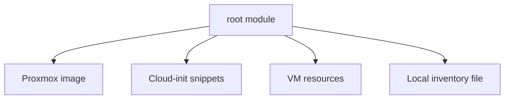

# Terraform Modules

## Оглавление

- [Что такое module](#что-такое-module)
- [Root module](#root-module)
- [Child modules](#child-modules)
- [Module registry](#module-registry)
- [Модули в этом проекте](#модули-в-этом-проекте)
- [Когда выделять модуль](#когда-выделять-модуль)
- [Anti-Patterns](#anti-patterns)

## Что такое module

Module — директория с Terraform-файлами. Любая Terraform-конфигурация является модулем.

Модуль может содержать:

- `main.tf`;
- `variables.tf`;
- `outputs.tf`;
- `providers.tf`;
- дополнительные `.tf` файлы.

## Root module

Root module — текущая директория, из которой запускается Terraform.

В этом проекте root module находится в корне репозитория:

```text
main.tf
providers.tf
variables.tf
outputs.tf
```

## Child modules

Child module вызывается из root module:

```hcl
module "vm" {
  source = "./modules/proxmox-vm"
  name   = "k3s-master-1"
}
```

Child modules помогают переиспользовать одинаковую логику.

## Module registry

Terraform Registry может хранить публичные modules:

```hcl
module "vpc" {
  source  = "terraform-aws-modules/vpc/aws"
  version = "5.0.0"
}
```

Для production важно фиксировать версии modules.

## Модули в этом проекте

Отдельных child modules сейчас нет. Это осознанно приемлемо: проект небольшой, создаёт один тип инфраструктуры и легче читается как root module.



## Когда выделять модуль

Модуль стоит выделять, если:

- появляется несколько типов VM;
- нужно переиспользовать VM-логику в нескольких проектах;
- появляются разные окружения `dev/stage/prod`;
- root module становится сложно читать;
- один и тот же набор resources копируется несколько раз.

Пример будущей структуры:

```text
modules/
└── proxmox-vm/
    ├── main.tf
    ├── variables.tf
    └── outputs.tf
```

## Anti-Patterns

| Anti-pattern | Почему плохо |
|---|---|
| Модуль ради одного resource | добавляет лишнюю навигацию |
| Слишком много переменных | модуль становится сложнее исходного кода |
| Скрытые provider-настройки внутри модуля | сложнее управлять версиями и доступом |
| Копирование модулей вместо versioning | расходятся реализации |
| Модуль без outputs | результаты трудно использовать |

