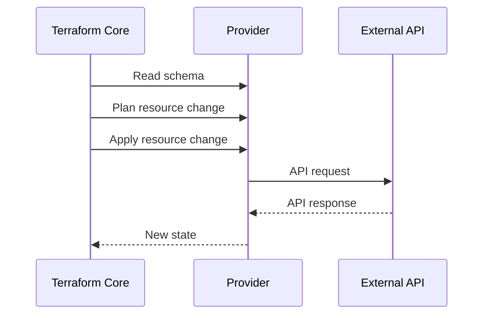

# Провайдеры Terraform

## Оглавление

- [Что такое provider](#что-такое-provider)
- [Реестр провайдеров](#реестр-провайдеров)
- [Версии и lock file](#версии-и-lock-file)
- [Взаимодействие с API](#взаимодействие-с-api)
- [Провайдеры в проекте](#провайдеры-в-проекте)
- [Устранение неполадок](#устранение-неполадок)

## Что такое provider

Provider — плагин Terraform, который знает API конкретной платформы.

Terraform Core вызывает provider через plugin protocol:



## Реестр провайдеров

Provider source:

```hcl
source = "bpg/proxmox"
```

Terraform преобразует его в адрес registry:

```text
registry.terraform.io/bpg/proxmox
```

Во время `terraform init` Terraform скачивает provider plugin.

## Версии и lock file

Версии задаются в `providers.tf`:

```hcl
required_providers {
  proxmox = {
    source  = "bpg/proxmox"
    version = ">= 0.78.0, < 1.0.0"
  }
}
```

`.terraform.lock.hcl` фиксирует конкретно выбранную версию и checksum. Это делает повторные init предсказуемыми.

## Взаимодействие с API

Provider обычно выполняет операции:

- Create;
- Read;
- Update;
- Delete.

Для Proxmox provider обращается к Proxmox API, а в этом проекте также использует SSH для загрузки snippets.

## Провайдеры в проекте

| Provider | Назначение |
|---|---|
| `bpg/proxmox` | Proxmox image, snippets, VM |
| `hashicorp/local` | запись generated Ansible inventory |

## Устранение неполадок

| Ошибка | Причина | Решение |
|---|---|---|
| `Missing required provider` | provider добавлен, но `init` не выполнен | запустить `make init` |
| `Invalid provider registry host` | контейнер не получает registry discovery JSON | проверить DNS, proxy, VPN |
| `Failed to query available provider packages` | нет доступа к registry | проверить сеть контейнера |
| checksum mismatch | повреждён cache или lock не совпадает | очистить `.terraform`, повторить init |
