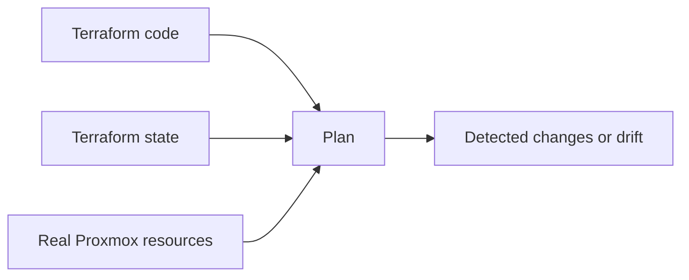
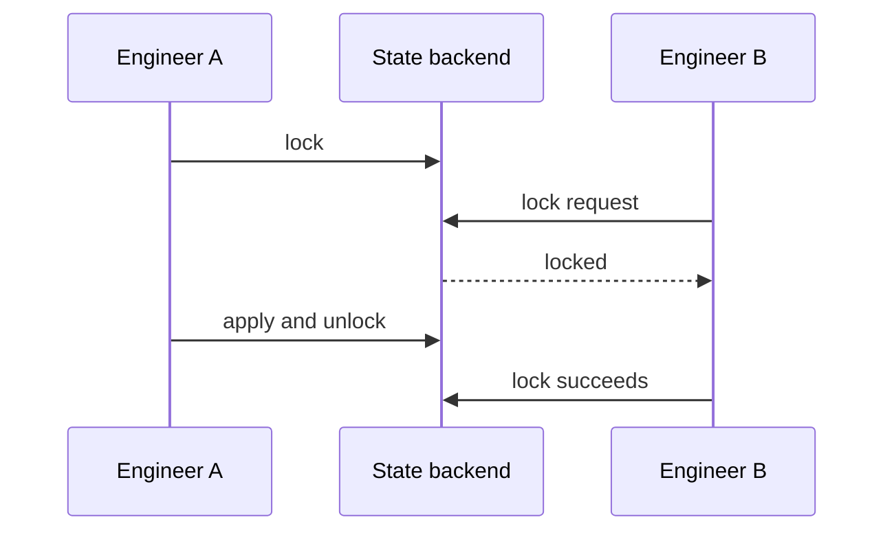

# Terraform State

## Оглавление

- [Что такое state](#что-такое-state)
- [Структура state](#структура-state)
- [Refresh и drift](#refresh-и-drift)
- [Import](#import)
- [State locking](#state-locking)
- [Remote state и backend](#remote-state-и-backend)
- [State в этом проекте](#state-в-этом-проекте)
- [Best Practices](#best-practices)
- [Troubleshooting](#troubleshooting)

## Что такое state

Terraform state — это база соответствий между конфигурацией и реальными ресурсами.

```text
Terraform address -> Real infrastructure object
```

Пример:

```text
proxmox_virtual_environment_vm.k3s["k3s-master-1"] -> Proxmox VMID 300
```

Без state Terraform не знает, какие реальные объекты были созданы этим проектом.

## Структура state

State хранится в JSON. В нём есть:

- версия state;
- lineage;
- serial;
- список resources;
- атрибуты ресурсов;
- sensitive flags;
- outputs.

Упрощённый пример:

```json
{
  "resources": [
    {
      "type": "proxmox_virtual_environment_vm",
      "name": "k3s",
      "instances": [
        {
          "index_key": "k3s-master-1",
          "attributes": {
            "vm_id": 300,
            "name": "k3s-master-1"
          }
        }
      ]
    }
  ]
}
```

State нельзя редактировать вручную: ошибка в JSON или неверный атрибут может привести к некорректным планам.

## Refresh и drift

Drift — расхождение между кодом, state и реальной инфраструктурой.



Пример drift:

1. Terraform создал VM с 2048 MB RAM.
2. Администратор вручную изменил RAM в Proxmox UI на 4096 MB.
3. `terraform plan` увидит отличие и предложит вернуть значение из кода или обновить ресурс.

`refresh` — процесс чтения реального состояния ресурсов через provider.

## Import

`terraform import` добавляет существующий ресурс в state.

Он не создаёт HCL автоматически в классическом workflow. Инженер должен:

1. написать resource block;
2. импортировать реальный объект;
3. выполнить `plan`;
4. привести код и state к совпадению.

Import полезен, когда ресурс создан вручную, но дальше должен управляться Terraform.

## State locking

State locking защищает state от одновременной записи.



Локальный backend имеет ограниченные возможности блокировки. Для команды лучше использовать remote backend с lock-механизмом.

## Remote state и backend

Backend определяет, где хранится state.

| Backend | Когда использовать |
|---|---|
| local | одиночная лаборатория |
| S3-compatible | команда, CI/CD, backup |
| Terraform Cloud | managed workflow |
| HTTP/GitLab | интеграция с GitLab |

Remote state нужен для:

- общего доступа команды;
- блокировок;
- резервного копирования;
- разграничения доступа;
- CI/CD.

## State в этом проекте

Проект использует local backend:

```text
terraform.tfstate
```

State игнорируется Git через `.gitignore`.

Критичные ресурсы в state:

- Proxmox cloud image;
- cloud-init snippets;
- VM;
- generated Ansible inventory;
- outputs с IP-адресами.

## Best Practices

- Не коммитить `terraform.tfstate`.
- Делать резервные копии state перед крупными изменениями.
- Не редактировать state вручную.
- Использовать `terraform state show` для диагностики.
- Использовать `terraform import` вместо ручного копирования JSON.
- Для командной работы перейти на remote backend.
- Не запускать два `apply` одновременно.

## Troubleshooting

| Симптом | Возможная причина | Решение |
|---|---|---|
| Terraform хочет создать уже существующую VM | потерян state | восстановить state или импортировать ресурс |
| `state lock` не снимается | прерванный apply | проверить, нет ли активного процесса; затем аккуратно снять lock |
| plan показывает неожиданные изменения | drift в Proxmox | сравнить Proxmox UI, state и HCL |
| output пустой | ресурс ещё не создан или IP неизвестен | проверить QEMU guest agent и `terraform state show` |

