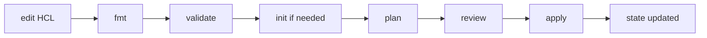
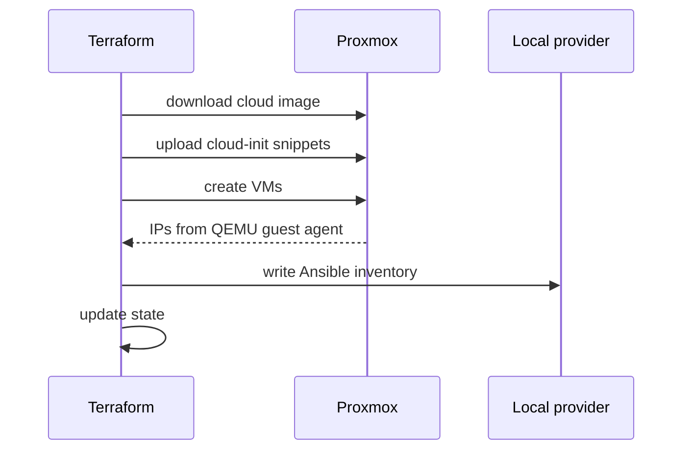

# Рабочие процессы Terraform

## Оглавление

- [Общий цикл](#общий-цикл)
- [init](#init)
- [fmt](#fmt)
- [validate](#validate)
- [plan](#plan)
- [apply](#apply)
- [destroy](#destroy)
- [Production-процесс](#production-процесс)

## Общий цикл



## init

```bash
make init
```

Внутренне Terraform:

1. читает `required_providers`;
2. скачивает plugins;
3. создаёт `terraform/.terraform/`;
4. обновляет `.terraform.lock.hcl`;
5. готовит backend.

Запускать после изменения providers или backend.

## fmt

```bash
make fmt
```

Форматирует HCL. Не обращается к Proxmox и не меняет state.

## validate

```bash
make validate
```

Проверяет синтаксис и schema providers. Не гарантирует, что Proxmox storage, bridge или credentials корректны.

## plan

```bash
make plan
```

Terraform:

- читает HCL;
- читает variables;
- читает state;
- refresh'ит реальные ресурсы;
- строит diff.

Символы:

| Символ | Значение |
|---|---|
| `+` | create |
| `~` | update |
| `-` | destroy |
| `-/+` | replace |

## apply

```bash
make apply
```

В проекте apply использует `-parallelism=1`, чтобы VM создавались последовательнее.

Процесс:



## destroy

```bash
make destroy
```

Удаляет управляемые Terraform ресурсы. Для VM это означает потерю данных на их дисках, если данные заранее не вынесены во внешнее хранилище.

## Production-процесс

Рекомендуемый командный процесс:

1. Change branch.
2. `make fmt`.
3. `make validate`.
4. `make plan`.
5. Review плана.
6. Apply из контролируемого окружения.
7. Сохранение артефактов и логов.

Для `dev/stage/prod` обычно используют отдельные state и переменные окружений.
